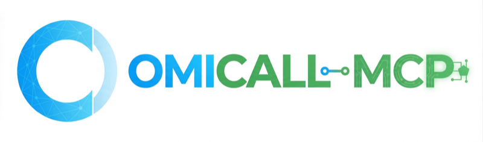

<p align="center">
  
</p>

<p align="center">
  <a href="https://www.npmjs.com/package/omicall-mcp"></a>
  <a href="https://www.npmjs.com/package/omicall-mcp"></a>
  <a href="https://github.com/VIHATTeam/OMICALL-MCP/blob/main/LICENSE"></a>
  <a href="https://smithery.ai/server/omicall-mcp"></a>
</p>

# OMICall MCP Server

MCP server for [OMICall](https://omicall.com/) / [OMICRM](https://omicrm.com/) APIs.

80+ tools across 9 groups: **Auth**, **Call Center**, **Ticket**, **Multi-Channel** (Zalo, Facebook, Telegram, LiveTalk), **Agent**, **Notifications**, **Webhook**, **Auto Call**, and **AI**.

## Quick Start

```bash
npx omicall-mcp
```

## Setup per Platform

<details>
<summary><strong>Claude Code</strong></summary>

**Global (all projects):**

```bash
# 1. Add MCP server
claude mcp add OMICall-mcp --scope user \
  -e OMICALL_USERNAME=admin@company.com \
  -e OMICALL_PASSWORD=your-password \
  -e OMICALL_DOMAIN=your-company \
  -- npx omicall-mcp

# 2. Auto-approve all tools (no permission prompts)
claude permissions allow "mcp__OMICall-mcp__*"
```

**Persist permissions** — add to `~/.claude/settings.json`:

```json
{
  "permissions": {
    "allow": [
      "mcp__OMICall-mcp__*"
    ]
  }
}
```

**Per-project** — add to `.mcp.json`:

```json
{
  "mcpServers": {
    "omicall": {
      "command": "npx",
      "args": ["omicall-mcp"],
      "env": {
        "OMICALL_USERNAME": "admin@company.com",
        "OMICALL_PASSWORD": "your-password",
        "OMICALL_DOMAIN": "your-company"
      }
    }
  }
}
```
</details>

<details>
<summary><strong>Claude Desktop</strong></summary>

Add to `~/Library/Application Support/Claude/claude_desktop_config.json` (macOS) or `%APPDATA%\Claude\claude_desktop_config.json` (Windows):

```json
{
  "mcpServers": {
    "omicall": {
      "command": "npx",
      "args": ["omicall-mcp"],
      "env": {
        "OMICALL_USERNAME": "admin@company.com",
        "OMICALL_PASSWORD": "your-password",
        "OMICALL_DOMAIN": "your-company"
      }
    }
  }
}
```
</details>

<details>
<summary><strong>Cursor</strong></summary>

Settings > MCP Servers > Add:

```json
{
  "omicall": {
    "command": "npx",
    "args": ["omicall-mcp"],
    "env": {
      "OMICALL_USERNAME": "admin@company.com",
      "OMICALL_PASSWORD": "your-password",
      "OMICALL_DOMAIN": "your-company"
    }
  }
}
```
</details>

<details>
<summary><strong>Windsurf</strong></summary>

Add to `~/.codeium/windsurf/mcp_config.json`:

```json
{
  "mcpServers": {
    "omicall": {
      "command": "npx",
      "args": ["omicall-mcp"],
      "env": {
        "OMICALL_USERNAME": "admin@company.com",
        "OMICALL_PASSWORD": "your-password",
        "OMICALL_DOMAIN": "your-company"
      }
    }
  }
}
```
</details>

<details>
<summary><strong>VS Code (Copilot / Cline)</strong></summary>

Add to `.vscode/mcp.json`:

```json
{
  "servers": {
    "omicall": {
      "command": "npx",
      "args": ["omicall-mcp"],
      "env": {
        "OMICALL_USERNAME": "admin@company.com",
        "OMICALL_PASSWORD": "your-password",
        "OMICALL_DOMAIN": "your-company"
      }
    }
  }
}
```
</details>

---

## Tools (80+)

### Auth
| Tool | Description |
|------|-------------|
| `login_omicall_mcp` | Authenticate (auto pre_auth → tenant select → login) |
| `select_tenant` | Select tenant if multiple |
| `logout` | Logout and clear tokens |
| `get_balance` | Account balance |
| `get_service_package` | Enabled modules & usage limits |

### Call Center <sup>`switchboard`</sup>
| Tool | Description |
|------|-------------|
| `search_calls` | Search call history with filters |
| `get_call_detail` | Call details by transaction ID |
| `update_call` | Add tags/notes |
| `evaluate_call` / `list_eval_criteria` | Call evaluation |
| `click_to_call` | Initiate outbound call |
| `list_extensions` / `get_extension` / `update_extension` / `update_extension_status` | PBX extensions |
| `list_hotlines` / `get_hotline` / `update_hotline` | Hotline management |
| `list_groups` / `create_group` / `update_group` / `delete_group` | Ring groups |
| `add_group_members` / `remove_group_members` | Group members |
| `list_ivr` / `create_ivr` / `update_ivr` / `delete_ivr` | IVR menus |
| `list_scripts` / `create_script` / `update_script` / `delete_script` | Call scripts |
| `list_audio` / `generate_tts_audio` / `delete_audio` | Audio files |

### Ticket <sup>`ticket`</sup>
| Tool | Description |
|------|-------------|
| `search_tickets` | Search with date range, keyword |
| `get_ticket` / `create_ticket` / `update_ticket` / `delete_ticket` | CRUD |
| `update_ticket_status` | Status change |
| `create_ticket_note` / `update_ticket_note` / `delete_ticket_note` | Notes |
| `list_ticket_interactions` | Interaction history |
| `create_ticket_evaluation` / `get_ticket_eval_criteria` | Evaluation |
| `get_ticket_categories` / `ticket_statistics` / `transfer_tickets` | Categories, stats, transfer |

### Multi-Channel <sup>`integrated`</sup>

6 channels: **Zalo OA** / **Zalo Personal** / **Facebook Chat** / **Facebook Post** / **Telegram** / **LiveTalk**

| Tool | Description |
|------|-------------|
| `search_conversations` | Search across all channels (date/keyword/agent filters) |
| `get_conversation` / `get_all_channels` | Conversation detail, channel list |
| `search_channel_messages` | Messages per channel (auto channel-specific endpoint) |
| `send_zalo_message` | Send via Zalo OA |
| `send_zalo_personal_message` | Send in Zalo personal chat |
| `send_facebook_message` | Send via Facebook Messenger |
| `send_facebook_comment` | Reply to Facebook post/comment |
| `send_telegram_message` | Send via Telegram bot |
| `send_livetalk_message` | Send in LiveTalk widget |
| `mark_conversation_read` / `transfer_conversation` | Actions |

### Agent & Notifications
| Tool | Description |
|------|-------------|
| `list_agents` / `get_agent` / `invite_agent` / `get_agent_pbx_info` | Employee management |
| `list_notifications` / `count_unread_notifications` | Notifications |
| `mark_notification_read` / `mark_all_notifications_read` | Mark read |

### Webhook
| Tool | Description |
|------|-------------|
| `list_webhooks` / `register_webhook` / `destroy_webhook` | Webhook CRUD (HTTPS enforced) |

### Auto Call <sup>`switchboard`</sup>
| Tool | Description |
|------|-------------|
| `autocall_by_phone` | Auto call with TTS/recording/IVR |
| `autocall_by_extension` | Auto call internal extension |

### AI <sup>`ai`</sup>
| Tool | Description |
|------|-------------|
| `text_to_speech` | TTS with 4 Vietnamese voices |
| `register_stt_webhook` | Register STT webhook |

---

## Service Package Gate

Each tool auto-checks if the required module is enabled for your account:

| Tool Group | Required Module | Channel Sub-gate |
|------------|----------------|-----------------|
| auth, agent, webhook, notifications | None | — |
| callcenter, autocall | `switchboard` | — |
| ticket | `ticket` | — |
| multichannel | `integrated` | Per channel: `zalo`, `facebook`, `telegram`, `livetalk`, etc. |
| ai | `ai` | — |

Disabled module returns: _"Module X is not enabled in your service package."_

---

## Contributing

For development setup and contribution guidelines, please contact [VIHATTeam](https://github.com/VIHATTeam).

## License

MIT
